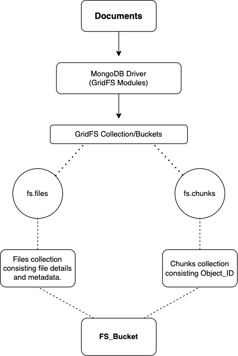
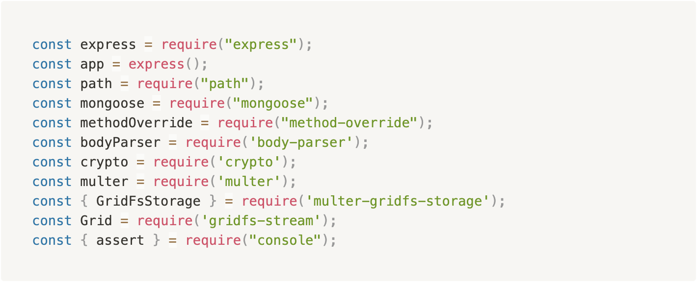
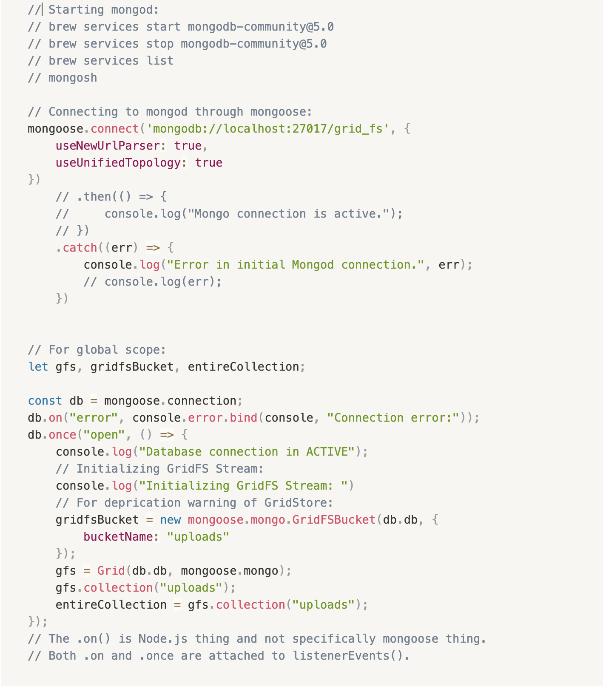
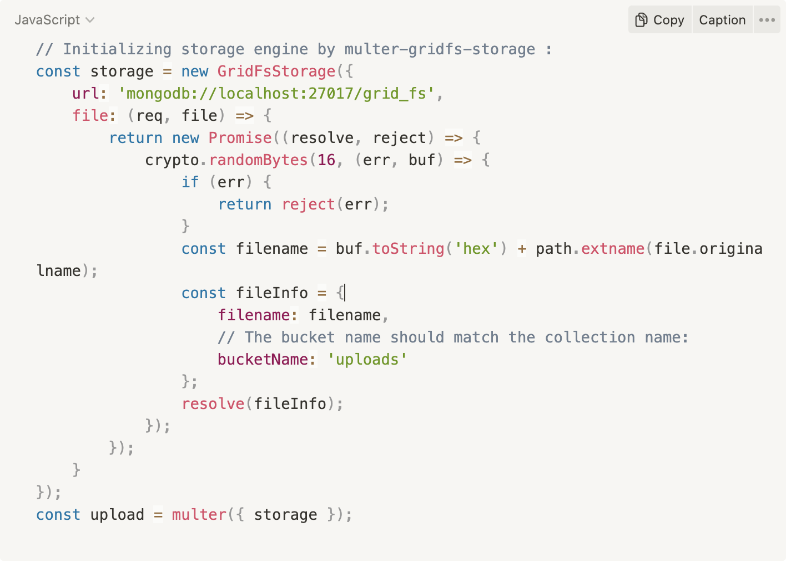
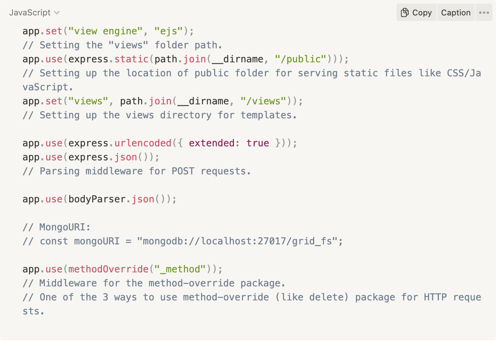

Implementing file storage and retrieval technique using GridFS in MongoDB

Akhil Rana
arana8@hawk.iit.edu
CSP554 Big Data Technologies
Mr. Jawahar Panchal
December 2, 2022
 
Introduction
	
Document databases can store files irrespective of the schema design which helps in adaptive storage and retrieval process. Using GridFS to shard collection into files and chunks enables easy access and sharing of files over web interface with additional security attributes.

The first V in defining ‘Big Data’ is the volume of data and especially unstructured data, which is amplifying rapidly with velocity and variety, generating large scale datasets. One such aspect of analysis and extraction of knowledge requires storing heavy document files in databases. An important use case of choosing MongoDB as the database to store files allows us a coherent file storage and retrieval technique. Instead of storing a file in a single document, GridFS divides the file into smaller chunks and store each chunk as a separate document.

GridFS is a specification for storing and retrieving files larger than the 16 MB size limit for BSON documents. GridFS divides a file into sections, or chunks, and saves each chunk as a separate document rather than storing the entire file in a single document. GridFS divides a file into 255 kB pieces by default, with the exception of the final chunk, and employs this default chunk size when dealing with files. The final portion is only as big as is required. Similar to this, files that do not exceed the chunk size just have a final chunk and occupy the minimum amount of space necessary plus some extra metadata.

GridFS stores files in two groupings. 1The file chunks are stored in one collection, while the file information is stored in the other. Each collection is described in depth under the section GridFS Collections. When you request a file from GridFS, the driver will reassemble the pieces as needed. Range queries may be run on files stored in GridFS. You may also retrieve data from arbitrary file parts, such as "skipping" to the center of a movie or audio clip.

GridFS is helpful not just for storing files larger than 16 MB, but also for storing any files that require access without requiring the complete file to be loaded into memory.

When should you use GridFS?
In some cases, storing huge files in a MongoDB database may be more efficient than on a system-level disk. If your filesystem restricts the amount of files that may be stored in a directory, you can utilize GridFS to store as many files as you need. 2GridFS may be used to remember chunks of files without reading the complete file into memory when you want to retrieve information from pieces of huge files without having to load entire files into memory.

GridFS may be used to maintain your files and metadata automatically synchronized and distributed across many systems and locations. MongoDB can automatically distribute files and their information to a number of mongod instances and facilities when employing globally distributed replica sets.

When not to use GridFS?
If you need to atomically change the content of a whole 2, file, avoid using GridFS. As an alternative, you may keep numerous copies of each file and designate the most recent version in the metadata. After uploading the new version of the file, you may use an atomic update to update the metadata field that shows "latest" status, and you can subsequently remove prior versions if necessary.

Furthermore, if all of your files are less than the 16 MB BSON Document Size restriction, consider storing them all in a single document rather than utilizing GridFS. To store binary data, use the BinData data type. For more information on utilizing BinData, consult your driver's documentation.

Architecture of GridFS
The flow diagram of my program.  ,3The execution will work in the following manner:

Going over the flow diagram, the user can upload a document (in my program it’s limited to photos with any extension due to parsing issues with the multer-storage plugin) via a form along with short description. The GridFS module stores the image in the database and specifically in the collection in the form of files and chunks whose importance is discussed in the design stage. Upon retrieval of the document (which is done simultaneously on the homepage where all the objects or testcases are displayed), the plugin fetches the various chunks and display the entire document i.e., the stored image.

Design
I’ve created an application to showcase the working of the GridFS module by implementing a form connected by the MongoDB database and the frontend homepage through mongoose and grid-fs stream package. Initially, we will work out way up by fetching the libraries needed from the application. The required libraries are shown below by the code snippet:
 

Figure 2: Libraries Installation.

Figure 3: Exporting and requiring libraries.

After requiring all the libraries, I’ll walk through the setup before connecting the API’s and database with the frontend. First, we need to establish a connection with MongoDB through mongoose and get up a schema for a collection to be stored through gridfs-stream package. Following the official documentation and modifying to our needs i.e., the callback functions. After we’ve established a connection with the database our codebase will look like the snippet provided below:

 
Figure 4: Code snippet of MongoDB connection through Mongoose.
Attaching the callback functions on mongoose.connect and mongoose.connection for catching errors and handling the event listeners. I’ve provided additional comments for better readability. Once our buckets and collections are named, we’ll move to initialize the storage engine by setting up multer-gridfs-storage which helps us to store the documents by using the gridfs-stream API for creating chunks and files for the document being uploaded into the database. Also, we benefit from the built-in methods for better functionality. We can set up the storage engine by the following snippet:

 
Figure 5: Code snippet of multer-gridfs-storage engine.
Here, we give the path of our mongo database’s url and the function returns a promise object after creating the name for the file using  ,4crypto plugin and it’s randomBytes method for 16 bit naming convention. We can also specify the extension of our document i.e, here it’s a image. ‘uploads’ is the bucket name specified by me as its being used at the mongo database.

Next step is setting up the middleware for our API calls. Middleware methods are exported by express library and we modify them according to our needs. I’ve included comments under each middleware and about its functionality. This concludes our setup and connections at the database level. For frontend I initially started developing react components but due to the limited routes, I’ve gone with EJS and have created a views directory under which all the pages are maintained.

 
Figure 6: Code snippet of the middleware used.
We can access the entire codebase by clicking on the project repository being hosted on GitHub. The repo link is: https://github.com/AkhilranaAR/CSP554-Project

Working
The user uploads the image through a form and the document is stored in the database with the following object structure. Storage engine along with gridfs-stream breaks the document into chunks and files whose data is stored in these individual objects. Also, this information is stored and can be viewed simultaneously on the right window named metadata. These are the objects that are tracked when the user retrieves the document. One chunk follows the other and so on. The advantage of GridFS is realised when the user wants to store user-generated file content and wants to access portions of file content through chunks. The length method of this object displays the size of the document in bytes and can be changed through multer-storage engine i.e.,  ,5crypto module. 
 

Figure 7: Code snippet of the object schema stored through gridfs-stream.
 

Figure 8: Screengrab of the metadata displayed on the homepage.

The application also supports various routes for different implementations such as displaying all the documents in the database, displaying specific image filtered by the file name which is generated and encrypted by the crypto plugin. The running application can be found on GitHub (https://github.com/AkhilranaAR/CSP554-Project) and a couple of screenshots are provided here for reference as well. Also, I’ve created a demo run of the application while the server is running under the Demo folder on the repo. Please feel free to view the application in action. 
 

Figure 9: Screengrab of the application.
 

Figure 10: Screengrab of the application.

Running Servers
The command for nodemon is nodemon app.js and will run the express server on localhost, port 8081. If successful, we’ll get the following messages logged in the terminal window:
 

Figure 11: Initiating nodemon.

We need to make sure our mongo server is also running by issuing the following command:
 

Figure 12: Starting mongodb.

Also, we can verify the documents being stored by logging into the mongodb database and looking up the records inside the specific collection or bucket. Be careful while accessing the chunks of a collection as an image is divided into numerous number of chunks which in turn is the biggest advantage of using GridFS and its core principle. Each of these chunks point to the next one hence making it efficient on document retrieval. 
 

Figure 13: Initiating mongo shell.
 

Figure 14: Selecting the correct collection inside the db.
 

Figure 15: Chunks representation of the documents under uploads collection.
 

Figure 16: Chunks representation of the documents under uploads collection .

Finally, we have the git version control system tracking our changes to the files inside the main directory.
 

Figure 17: git logs and commands.
GitHub Repository Link
We can access the entire codebase by clicking on the project repository being hosted on GitHub. The repository link is: https://github.com/AkhilranaAR/CSP554-Project. I’ve also uploaded a short demonstration run of the application on the repository as a dry run but feel free to download the application to run it locally.

Conclusion
The application accepts an image and uploads the document to MongoDB database implementing GridFS module through gridfs-stream package with additional constrains discussed above. The image is divided into chunks and files along with other metadata specified under the multer plugin. This type of distribution is the main advantage of GridFS which is also discussed in detail, and is studied and implemented for storage and retrieval purposes. The application is tested with several images and the results infer that the distribution of chunks is consistent along a specific extension of file which is directly proportional to the size of the document. In such test cases the upload time was also consistent but may change on different types of documents such as videos and text files as the encoding can differ. Objects stored in the database can be viewed by navigating to the proper route. Also, the metadata is displayed on the homepage for better comparison of different types of image. Images can be differentiated on their dimensions and size, pixel information, colour information, etc.

References
1.	Qinghu, Li. Jianmin, Wang. Lam, Kwok Yan. Jiaguang, Sun. GridFS: A Web-Based Data Grid for the Distributed Sharing of Educational Resource Files. Springer, Berlin, Heidelberg. 2003. https://link.springer.com/chapter/10.1007/978-3-540-45200-3_9
2.	Kudo, Tsukasa. Ito, Yuki. Serizawa, Yuki. An Application of MongoDB to Enterprise System Manipulating Enormous Data. International Journal of Informatics Society. Vol. 9, No. 3. 2017. http://www.infsoc.org/journal/vol09/IJIS_09_3_097-108.pdf
3.	2022 MongoDB, Inc. “GridFS” mongodb 2022. November 10, 2022. https://www.mongodb.com/docs/manual/core/gridfs/#std-label-gridfs-collections
4.	2022 MongoDB, Inc. “Sharding” mongodb 2022. November 11, 2022. https://www.mongodb.com/docs/upcoming/sharding/ 
5.	Wang, Shuang. Li, Guoqing. “A Distributed Storage and Access Approach for Massive Remote Sensing Data in MongoDB”. MDPI. November 27, 2019. https://www.mdpi.com/2220-9964/8/12/533/htm
6.	Qinghu, Li. Jianmin, Wang. Lam, Kwok Yan. Jiaguang, Sun. “GridFS: A Web-Based Data Grid for the Distributed Sharing of Educational Resource Files”. Springer, Berlin, Heidelberg. 2003. https://link.springer.com/chapter/10.1007/978-3-540-45200-3_9
7.	Kudo, Tsukasa. Ito, Yuki. Serizawa, Yuki. “An Application of MongoDB to Enterprise System Manipulating Enormous Data”. International Journal of Informatics Society. Vol. 9, No. 3. 2017. http://www.infsoc.org/journal/vol09/IJIS_09_3_097-108.pdf
8.	M. Chopade, Rupali, S. Dhavase, Nikhil. “MongoDB, CouchBase: Performance Comparison for Image Dataset”. International Conference for Convergence in Technology (I2CT). Volume 2. 2017. 
9.	Yishan Li, Sathiamoorthy Manoharan, “A performance comparison of SQL and NoSQL databases”, IEEE Pacific Rim Conference on Communications, Computers and Signal Processing (PACRIM), pp15- 19, Aug 2013. 

